# Trade Forecasting with Confluent Intelligence (AI Agent CLI Lab)

## Overview

In this lab you will build a fully managed, real-time trade analytics pipeline on Confluent Cloud — entirely through natural language. You will direct **Bob (your AI agent)** with plain-English prompts; Bob translates them into the correct Confluent CLI commands and executes them on your behalf. Your job is to verify each step in the Confluent Cloud console as it happens.

**The scenario:** An online trading platform is streaming stock trades continuously. The team needs to enrich each trade with live customer profile data, then use built-in machine learning to detect which stocks are surging before the peak hits.

By the end of the lab you will have provisioned and wired together the following assets:

| Asset Type | Purpose |
|---|---|
| Kafka Cluster | Managed broker that carries all event streams |
| Kafka Topic (×2) | Continuous streams of synthetic user and trade events |
| Source Connector (Datagen ×2) | Generates user profile and stock trade data into their respective topics |
| Flink Compute Pool | Serverless compute that runs all Flink SQL statements |
| Flink Materialized Table (×3) | Keyed user lookup, enriched trade stream, and per-symbol forecast |
| Snowflake Sink Connector | Streams `trades_forecast` topic into Snowflake in real time |
| Snowflake Table | `LAB.CONFLUENT.TRADES_FORECAST` — auto-created, live ML forecast data |

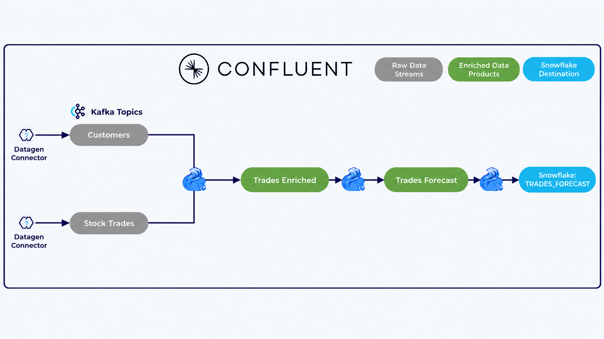

---

---

## 1. Authentication & Environment Setup

Log in to Confluent Cloud via the CLI and set your active environment context to the pre-provisioned lab environment.

### CLI Login

Run the following command to authenticate with your Confluent Cloud account:

```bash
confluent login --save
```

This will open a browser window for SSO login. Once authenticated, your credentials are saved locally for the session.

### Find Your Lab Environment

A Confluent environment has already been created for this lab — you do not need to create one or set it as active via the CLI. Simply list your environments to find the lab environment name:

```bash
confluent environment list
```

The environment name shown in the output (e.g. `dev-day-env`) is what you will reference in your prompts to Bob.

### UI Verification Checkpoint — Confirm Environment Name

Open [Confluent Cloud Environments](https://confluent.cloud/environments) and double-check that the environment name matches what you saw in the CLI output. This is the name you will use in your prompts to Bob — for example: *"Run this in my dev-day-env environment."*

<blockquote style="border-left: 4px solid #f0c040; padding: 10px 14px; margin: 8px 0;">
  <strong>⚠️ Note:</strong> The environment name <code>dev-day-env</code> shown in the screenshot below is just an example. Your pre-created lab environment may have a different name. Always use the actual environment name returned by <code>confluent environment list</code> (or check it directly in the Confluent Cloud UI).
</blockquote>

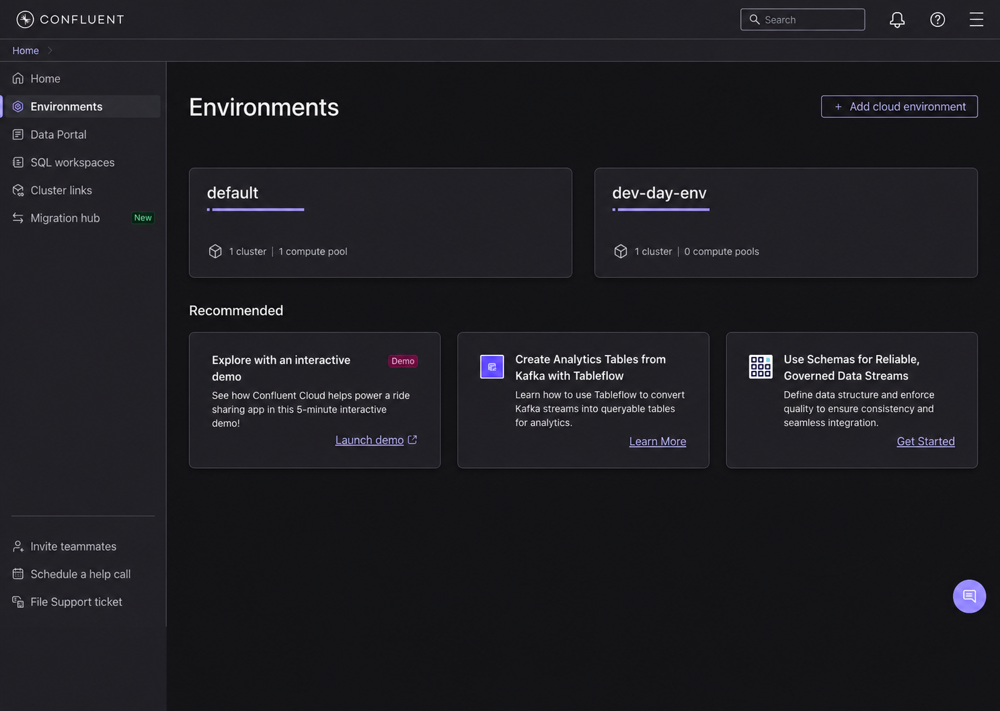

---

## 2. Provision Managed Kafka Cluster & API Keys

Ask Bob to provision a managed Kafka cluster and generate the necessary API keys.

### 💬 Prompt Bob

> **"Provision a Standard Kafka cluster called `dev-day-cluster` in AWS `us-east-2` (Ohio) in my active environment. Once it's running, generate a cluster API key and secret and configure the CLI context to use them."**

<details>
<summary>⚙️ What Bob does under the hood</summary>

Bob provisions the cluster, waits for status `UP`, and configures authentication:
```bash
confluent kafka cluster create dev-day-cluster --cloud aws --region us-east-2 --type standard
confluent kafka cluster use <CLUSTER_ID>
confluent api-key create --resource <CLUSTER_ID> --description "Lab CLI Key"
confluent api-key use <API_KEY> --resource <CLUSTER_ID>
```
</details>

### UI Verification Checkpoint

Navigate to **Clusters** in the Confluent Cloud console. Confirm your cluster status is **Running**.

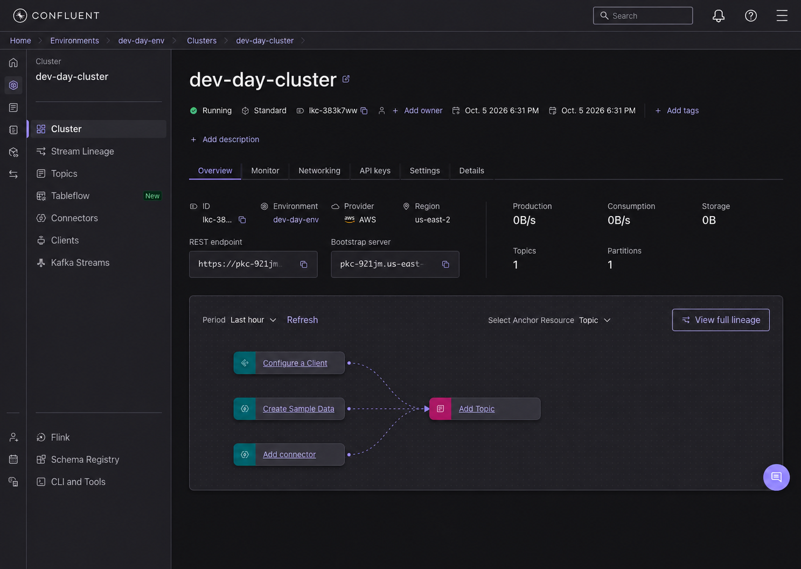

---

## 3. Deploy Datagen Source Connectors

Ask Bob to stand up the mock data streams using Confluent's Datagen Source connectors.

### 💬 Prompt Bob

> **"Deploy two Datagen Source connectors to my cluster using AVRO format: one for Users (`sample_data_users` topic using the `USERS` quickstart) and one for Stock Trades (`sample_data_stock_trades` topic using the `STOCK_TRADES` quickstart). Then verify that messages are streaming into both topics."**

<details>
<summary>⚙️ What Bob does under the hood</summary>

Bob generates the connector configuration files dynamically with your cluster credentials and deploys them:
```bash
confluent connect cluster create --config-file /tmp/connector-users.json --cluster <CLUSTER_ID>
confluent connect cluster create --config-file /tmp/connector-stock-trades.json --cluster <CLUSTER_ID>
confluent connect cluster list
confluent kafka topic consume sample_data_users -b --value-format avro
confluent kafka topic consume sample_data_stock_trades -b --value-format avro
```
</details>

### UI Verification Checkpoint

Navigate to **Connectors** in the Confluent Cloud console. Confirm both connectors show **Running** status with active throughput.

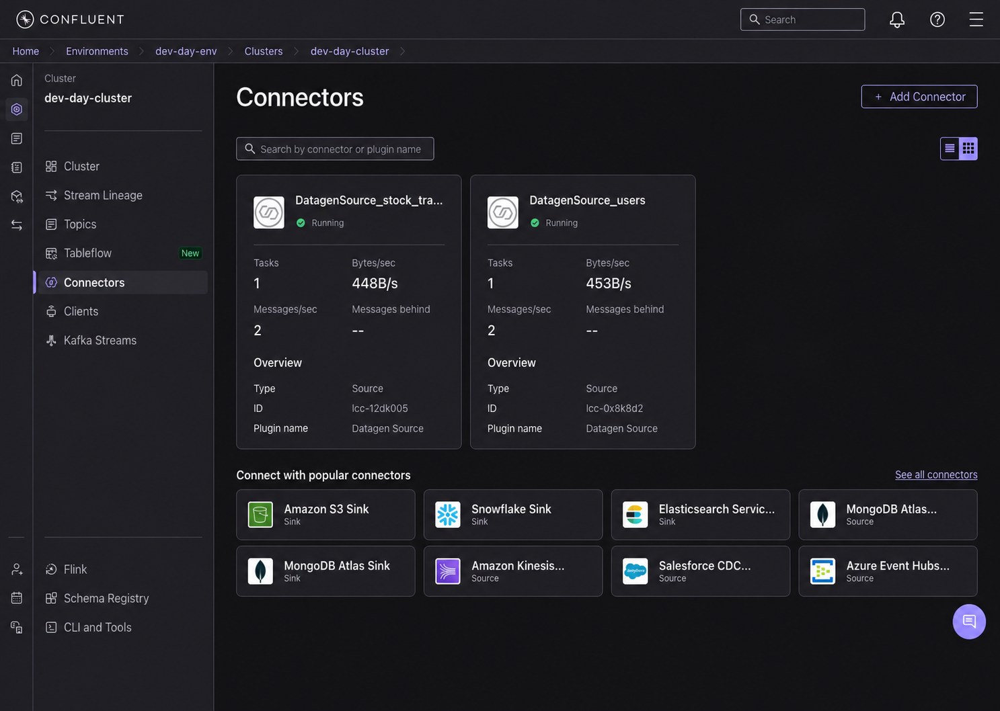

---

## 4. Provision Apache Flink Compute Pool

Ask Bob to set up the serverless Flink compute pool in the matching region.

### 💬 Prompt Bob

> **"Create a Flink compute pool called `dev-day-pool` in AWS `us-east-2` with 10 max CFUs in my environment, and set it as my active compute pool."**

<details>
<summary>⚙️ What Bob does under the hood</summary>

Bob provisions the Flink pool and switches the CLI context:
```bash
confluent flink compute-pool create dev-day-pool --cloud aws --region us-east-2 --max-cfu 10 --wait
confluent flink compute-pool use <COMPUTE_POOL_ID>
```
</details>

### UI Verification Checkpoint

Navigate to **Flink** → **Compute pools** in Confluent Cloud. Confirm `dev-day-pool` shows **Running**.

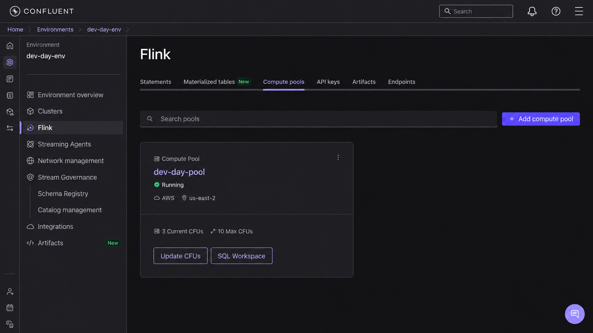

---

## 5. Build the Enrichment & Forecasting Pipeline (Flink SQL)

Now instruct Bob to deploy the continuous stream transformations as Materialized Tables.

### 5.1 Key Users Lookup Table

### 💬 Prompt Bob

> **"Create a materialized table called `users_keyed` in Flink from the `sample_data_users` stream, setting `userid` as the non-enforced primary key."**

<blockquote style="border-left: 4px solid #f0c040; padding: 10px 14px; margin: 8px 0;">
  <strong>💡 What is a non-enforced primary key?</strong><br/>
  In Flink SQL, a <strong>non-enforced primary key</strong> (<code>PRIMARY KEY … NOT ENFORCED</code>) declares which column uniquely identifies each row — in this case <code>userid</code> — but does <em>not</em> validate or reject duplicate values at insert time. Flink uses this hint purely as metadata for query optimisation (e.g. to avoid unnecessary deduplication joins). The responsibility for ensuring uniqueness lies with the upstream data source, not the table itself.
</blockquote>

<details>
<summary>⚙️ What Bob does under the hood</summary>

Bob synthesizes and submits the Flink SQL statement:
```bash
confluent flink statement create users-keyed \
  --database <CLUSTER_ID> \
  --sql "CREATE MATERIALIZED TABLE users_keyed (
    userid STRING NOT NULL,
    regionid STRING,
    gender STRING,
    PRIMARY KEY (userid) NOT ENFORCED
  ) AS
  SELECT COALESCE(userid, '') AS userid, regionid, gender FROM sample_data_users;" \
  --wait
```
</details>

---

### 5.2 Enrich Trades with Customer Context

### 💬 Prompt Bob

> **"Create a materialized table called `trades_enriched` that performs a temporal join between `sample_data_stock_trades` and `users_keyed` on `userid` as of the trade rowtime."**

<details>
<summary>⚙️ What Bob does under the hood</summary>

Bob constructs the temporal join query and submits it:
```bash
confluent flink statement create trades-enriched \
  --database <CLUSTER_ID> \
  --sql "CREATE MATERIALIZED TABLE trades_enriched AS
  SELECT
    t.userid,
    t.symbol,
    t.side,
    t.quantity,
    t.price,
    u.regionid,
    u.gender
  FROM sample_data_stock_trades t
  JOIN users_keyed FOR SYSTEM_TIME AS OF t.\`\$rowtime\` AS u
    ON t.userid = u.userid;" \
  --wait
```
</details>

---

### 5.3 Real-Time Trade Forecasting (`ML_FORECAST`)

### 💬 Prompt Bob

> **"Create a materialized table called `trades_forecast` that tumbles `trades_enriched` into 10-second windows per stock symbol and applies `ML_FORECAST` with a minimum training size of 10 and horizon of 5 to predict next-window trade counts and upper bounds."**

<details>
<summary>⚙️ What Bob does under the hood</summary>

Bob constructs the windowed ML forecasting pipeline and submits it:
```bash
confluent flink statement create trades-forecast \
  --database <CLUSTER_ID> \
  --sql "CREATE MATERIALIZED TABLE trades_forecast AS
  SELECT
    symbol,
    ts,
    trade_count                AS current_count,
    forecast[1].forecast_value AS forecast_count,
    forecast[1].upper_bound    AS upper_bound
  FROM (
    SELECT
      symbol,
      window_end AS ts,
      trade_count,
      ML_FORECAST(
        CAST(trade_count AS DOUBLE),
        window_end,
        JSON_OBJECT('minTrainingSize' VALUE 10, 'horizon' VALUE 5)
      ) OVER (
        PARTITION BY symbol
        ORDER BY window_time
      ) AS forecast
    FROM (
      SELECT symbol, window_end, window_time, COUNT(*) AS trade_count
      FROM TABLE(
        TUMBLE(TABLE trades_enriched, DESCRIPTOR(\$rowtime), INTERVAL '10' SECONDS)
      )
      GROUP BY symbol, window_start, window_end, window_time
    )
  )
  WHERE CARDINALITY(forecast) >= 1;" \
  --wait
```
</details>

### UI Verification Checkpoint

Check **Flink** → **Materialized tables** and **Statements** in the Confluent Cloud console. Confirm all 3 pipelines are active.

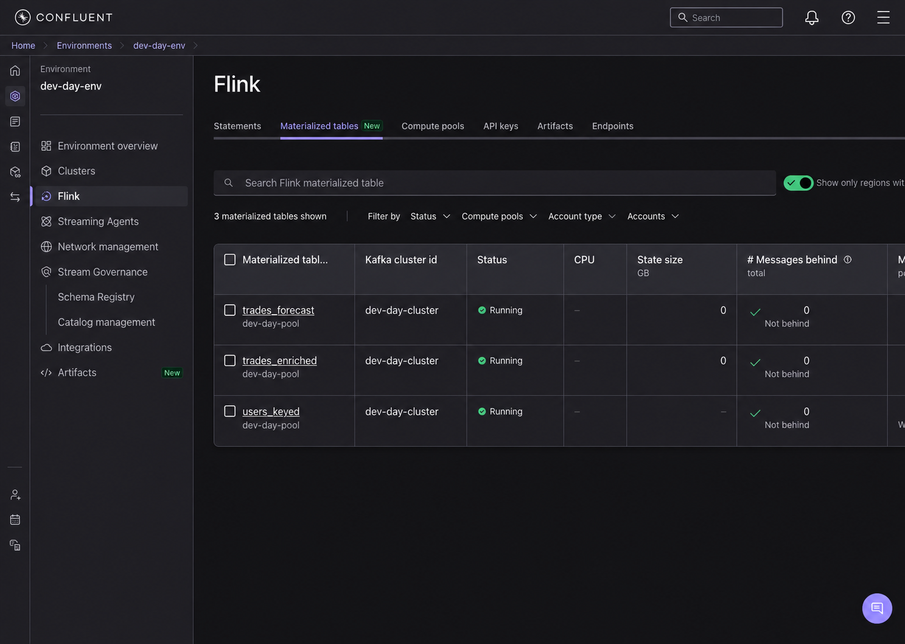

---

## 6. Query Live Enriched & Forecast Streams (Confluent SQL Workspace)

Inspect the live streams in the Confluent SQL Workspace to verify that transformations and real-time predictions are producing data.

### 6.1 Inspect Enriched Trades

Open your **SQL Workspace** in Confluent Cloud (or connect via Flink Shell) and run:

```sql
SELECT * FROM trades_enriched;
```

You will see live trade transactions continuously enriched with user demographics (`regionid`, `gender`) flowing through the pipeline in real time.

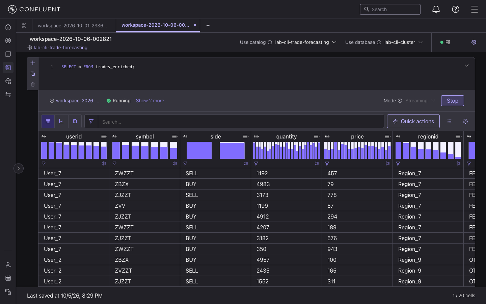

---

### 6.2 Inspect Real-Time Predictions & Surges

### 💬 Prompt Bob

> **"Write a query to retrieve the most recent window's forecast for each stock symbol so we can see which stocks are surging."**

In your **SQL Workspace** (or via Flink Shell), run:
```sql
SELECT symbol, current_count, forecast_count, upper_bound
FROM (
  SELECT *,
    ROW_NUMBER() OVER (PARTITION BY symbol ORDER BY `$rowtime` DESC) AS row_num
  FROM trades_forecast
)
WHERE row_num = 1;
```

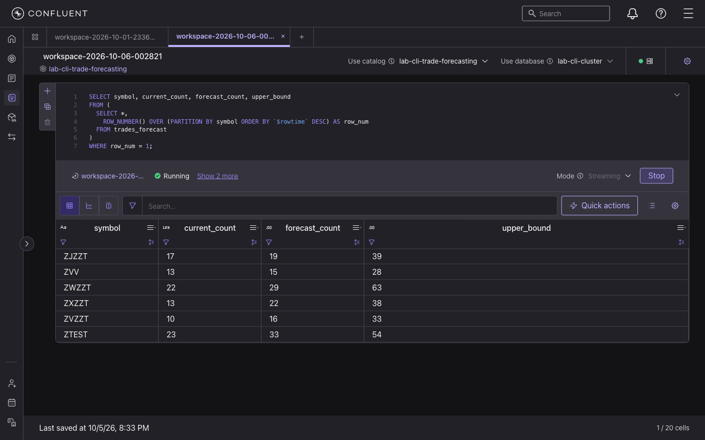

#### Interpreting the Forecast
- **`current_count`**: Trades recorded in the latest 10-second window.
- **`forecast_count`**: Predicted volume for the upcoming window.
- **`upper_bound`**: Upper confidence interval.
- When `forecast_count` > `current_count`, trading activity is **heating up**, allowing proactive capacity and alert provisioning.

---

## 7. Stream Live Forecast Data to Snowflake

With `trades_forecast` now producing real-time ML predictions and verified in Confluent Cloud, this step connects Confluent Cloud to Snowflake — streaming every forecast row into a live Snowflake table automatically. You will sign up for a free Snowflake trial, install the Snowflake CLI, set up authentication, and deploy the Snowflake Sink Connector entirely through Bob prompts.

By the end of this step you will have a live `LAB.CONFLUENT.TRADES_FORECAST` table in Snowflake that grows continuously as new forecasts are produced by Flink.

---

### 7.1 Sign Up for Snowflake Free Trial

Before Bob can help, you need a Snowflake account. This is a one-time manual step.

1. Go to [https://signup.snowflake.com](https://signup.snowflake.com) and create a free trial account
2. Choose **AWS** as your cloud provider and **US East (Ohio)** as the region — this matches your Confluent Cloud cluster
3. Verify your email and log in to [https://app.snowflake.com](https://app.snowflake.com)
4. Once logged in, find your **account identifier** from the URL: `https://app.snowflake.com/<org>/<account>` — note both parts (e.g. `vrlnecq` and `xo34979`) combined as `vrlnecq-xo34979`

> **Note:** You can also find your account identifier by clicking your account name in the **bottom-left** of the Snowflake UI.

---

### 7.2 Install Snowflake CLI

### 💬 Prompt Bob

> **"Install the Snowflake CLI tool on my Machine."**

<details>
<summary>⚙️ What Bob does under the hood</summary>

```bash
brew install snowflake-cli
snow --version
```
</details>

**Expected output:** `Snowflake CLI version: 3.x.x` ✅

> ⚠️ You may see a harmless `UserWarning: incompatible version of 'pyarrow'` warning after every `snow` command. It does not affect functionality — ignore it.

---

### 7.3 Connect Snowflake CLI to Your Account

This step requires your Snowflake password — **you will run this command yourself** in the terminal. Bob cannot enter passwords on your behalf.

### 💬 Prompt Bob

> **"What command do I run to add my Snowflake account to the Snow CLI? My account identifier is `<YOUR_ACCOUNT_ID>`, my username is `<YOUR_USERNAME>`, and my warehouse is `COMPUTE_WH`."**

Bob will print the exact command for you. It will look like:

```bash
snow connection add \
  --connection-name lab \
  --account <YOUR_ACCOUNT_ID> \
  --user <YOUR_USERNAME> \
  --warehouse COMPUTE_WH \
  --database SNOWFLAKE \
  --schema PUBLIC
```

> ⚠️ **Run this command yourself.** It will prompt you for your password interactively — this is intentional. Use `--database SNOWFLAKE` (not `LAB`) at this stage since the LAB database doesn't exist yet.

Once you've run it, ask Bob to verify the connection:

### 💬 Prompt Bob

> **"Verify my Snowflake CLI connection called `lab` is working."**

<details>
<summary>⚙️ What Bob does under the hood</summary>

```bash
snow sql --connection lab -q "SELECT CURRENT_USER(), CURRENT_ACCOUNT();"
```
</details>

**Expected output:** Your Snowflake username and account ID returned ✅

---

### 7.4 Create Snowflake Database and Schema

### 💬 Prompt Bob

> **"Create a database called `LAB` and a schema called `CONFLUENT` inside it in Snowflake using the `lab` connection."**

<details>
<summary>⚙️ What Bob does under the hood</summary>

```bash
snow sql --connection lab -q "
CREATE DATABASE IF NOT EXISTS LAB;
CREATE SCHEMA IF NOT EXISTS LAB.CONFLUENT;
"
```
</details>

**Expected output:** `Database LAB successfully created` and `Schema CONFLUENT successfully created` ✅

> ℹ️ **Do NOT create the `TRADES_FORECAST` table yourself.** The connector will auto-create it with the correct schema. Pre-creating it causes a schema compatibility error.

---

### 7.5 Generate RSA Key Pair & Assign to Your Snowflake User

The Snowflake Sink Connector does **not** support username + password authentication — it requires an RSA key pair. Bob will generate the key pair and assign the public key to your Snowflake user.

### 💬 Prompt Bob

> **"Generate an RSA key pair for the Snowflake Sink Connector and assign the public key to my Snowflake user `<YOUR_USERNAME>` using the `lab` connection."**

<details>
<summary>⚙️ What Bob does under the hood</summary>

```bash
# Generate 2048-bit RSA private key (PKCS8, unencrypted)
openssl genrsa 2048 | openssl pkcs8 -topk8 -nocrypt -out /tmp/snowflake_key.p8

# Derive public key
openssl rsa -in /tmp/snowflake_key.p8 -pubout -out /tmp/snowflake_key.pub

# Assign public key to your Snowflake user
PUB_KEY=$(cat /tmp/snowflake_key.pub | grep -v "PUBLIC KEY" | tr -d '\n')
snow sql --connection lab -q "ALTER USER <YOUR_USERNAME> SET RSA_PUBLIC_KEY='$PUB_KEY';"
```
</details>

**Expected output:** `Statement executed successfully` ✅

---

### 7.6 Deploy the Snowflake Sink Connector

### 💬 Prompt Bob

> **"Deploy a Snowflake Sink Connector called `SnowflakeSink_trades_forecast` that streams the `trades_forecast` Kafka topic into `LAB.CONFLUENT` in Snowflake. Use my Snowflake account `<YOUR_ACCOUNT_ID>`, username `<YOUR_USERNAME>`, role `ACCOUNTADMIN`, SNOWPIPE_STREAMING ingestion with schematization enabled, and AVRO input format."**

<details>
<summary>⚙️ What Bob does under the hood</summary>

Bob builds the connector config via Python (to safely embed the private key) then deploys it:

```python
# Build config — Python handles the base64 key safely on macOS
import json

with open('/tmp/snowflake_key.p8') as f:
    lines = f.readlines()
private_key = ''.join(l.strip() for l in lines if 'PRIVATE KEY' not in l)

config = {
  "name": "SnowflakeSink_trades_forecast",
  "config": {
    "connector.class": "SnowflakeSink",
    "kafka.auth.mode": "KAFKA_API_KEY",
    "kafka.api.key": "<KAFKA_API_KEY>",
    "kafka.api.secret": "<KAFKA_API_SECRET>",
    "topics": "trades_forecast",
    "input.data.format": "AVRO",
    "snowflake.url.name": "<YOUR_ACCOUNT_ID>.snowflakecomputing.com",
    "snowflake.user.name": "<YOUR_USERNAME>",
    "snowflake.private.key": private_key,
    "snowflake.role.name": "ACCOUNTADMIN",
    "snowflake.database.name": "LAB",
    "snowflake.schema.name": "CONFLUENT",
    "snowflake.ingestion.method": "SNOWPIPE_STREAMING",
    "snowflake.enable.schematization": "true",
    "tasks.max": "1"
  }
}
```

```bash
confluent connect cluster create \
  --config-file /tmp/connector-snowflake-sink.json \
  --cluster <CLUSTER_ID>
```
</details>

### UI Verification Checkpoint

Navigate to **Connectors** in the Confluent Cloud console. Confirm `SnowflakeSink_trades_forecast` shows **Running** status with **1 task running**.

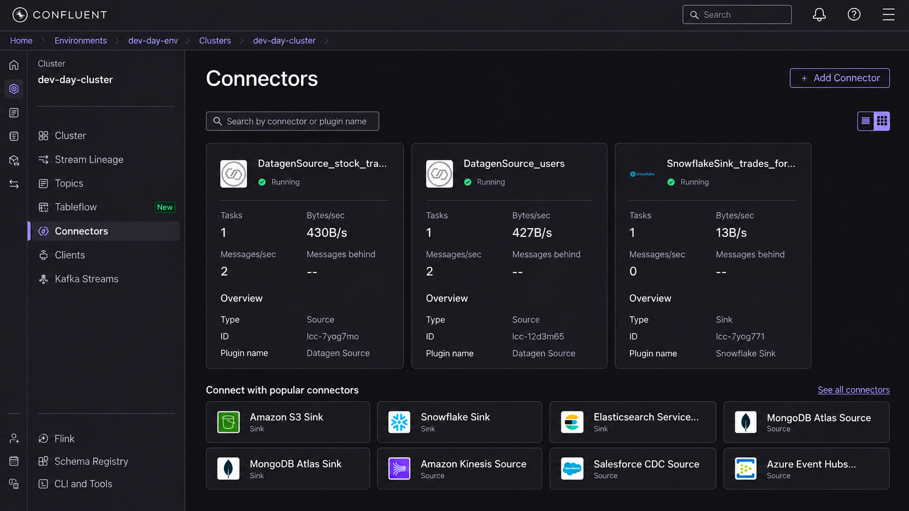

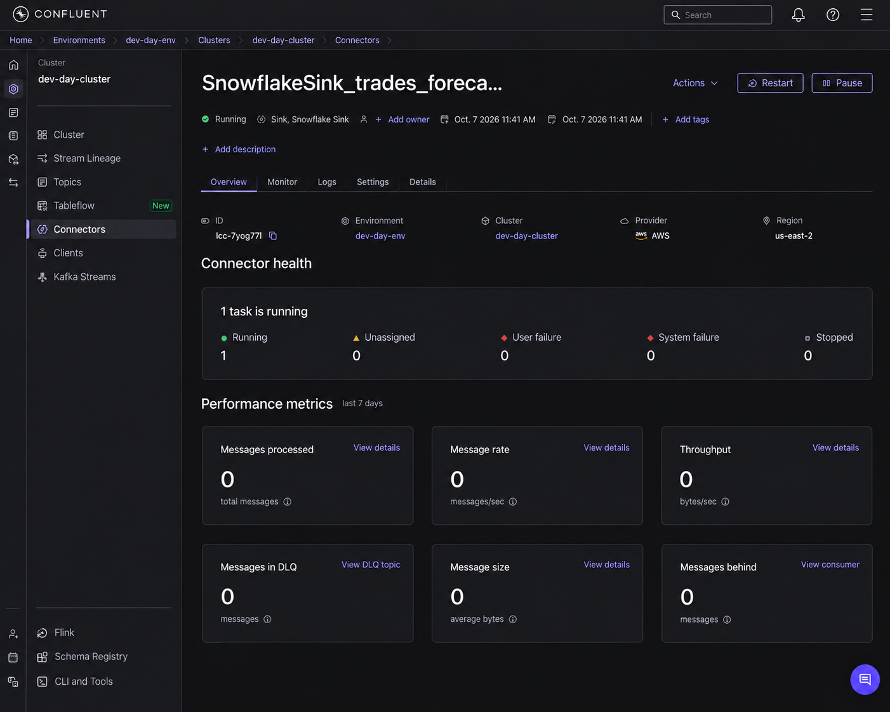

---

### 7.7 Verify Live Data Arriving in Snowflake

Wait approximately **90 seconds** after the connector reaches Running status, then ask Bob to check.

### 💬 Prompt Bob

> **"Check how many rows have arrived in `LAB.CONFLUENT.TRADES_FORECAST` in Snowflake, and show me the 10 most recent forecast rows."**

<details>
<summary>⚙️ What Bob does under the hood</summary>

```bash
# Row count
snow sql --connection lab -q "SELECT COUNT(*) FROM LAB.CONFLUENT.TRADES_FORECAST;"

# Latest 10 rows
snow sql --connection lab -q "
SELECT SYMBOL, TS, CURRENT_COUNT, FORECAST_COUNT, UPPER_BOUND
FROM LAB.CONFLUENT.TRADES_FORECAST
ORDER BY TS DESC
LIMIT 10;"
```
</details>

**Expected output (example):**
```
SYMBOL | TS            | CURRENT_COUNT | FORECAST_COUNT | UPPER_BOUND
ZWZZT  | 1791388000000 | 19            | 23.0           | 67.0
ZBZX   | 1791388000000 | 16            | 16.0           | 30.0
ZVV    | 1791388000000 | 16            | 15.0           | 31.0
ZJZZT  | 1791388000000 | 28            | 18.0           | 36.0
...
```

> ℹ️ Row count grows slowly at first — `ML_FORECAST` needs a minimum of 10 training windows per symbol before emitting forecasts. Once that threshold is met, new rows arrive every ~10 seconds per symbol.

### UI Verification Checkpoint — Snowflake

Open [Snowflake](https://app.snowflake.com) and navigate to **LAB → CONFLUENT → TRADES_FORECAST**. You should see the table auto-created with 6 columns and a live row count growing.

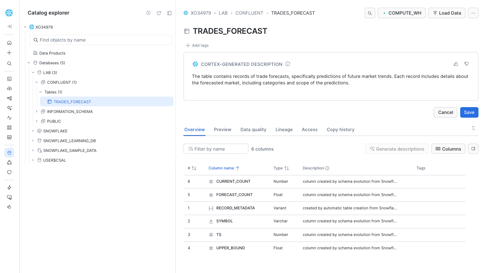

Click the **Preview** tab to see live rows streaming in from Confluent.

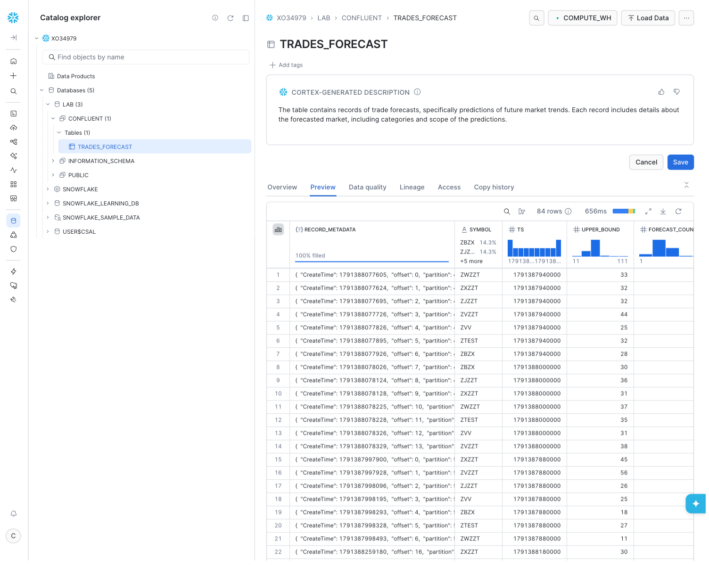

#### What the columns mean
- **`SYMBOL`** — Stock ticker (e.g. `ZBZX`, `ZVZZT`)
- **`TS`** — Window end timestamp in milliseconds
- **`CURRENT_COUNT`** — Actual trades recorded in the latest 10-second window
- **`FORECAST_COUNT`** — ML-predicted trade volume for the next window
- **`UPPER_BOUND`** — Upper confidence bound of the forecast
- **`RECORD_METADATA`** — Kafka metadata (partition, offset, topic, timestamp)

When `FORECAST_COUNT` > `CURRENT_COUNT`, trading activity is **heating up** — the platform can proactively provision capacity or trigger alerts before the surge peaks.
